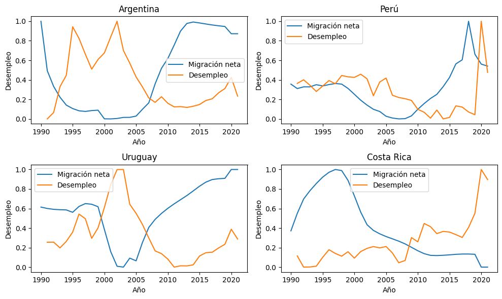
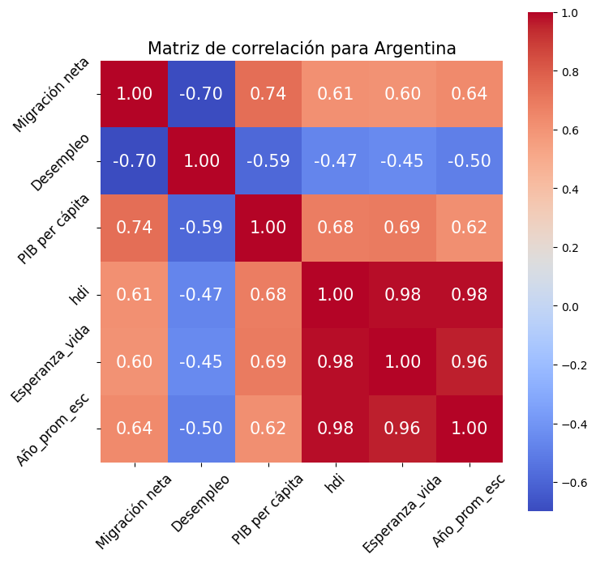
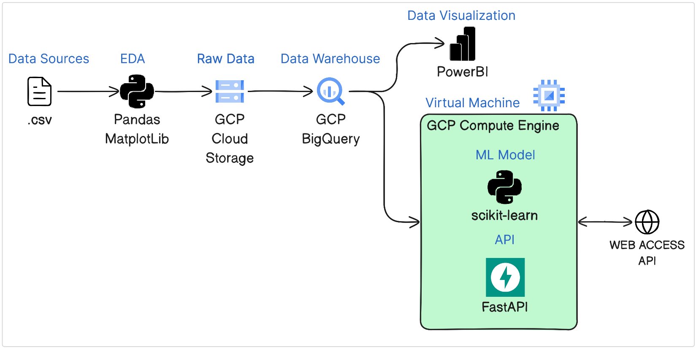
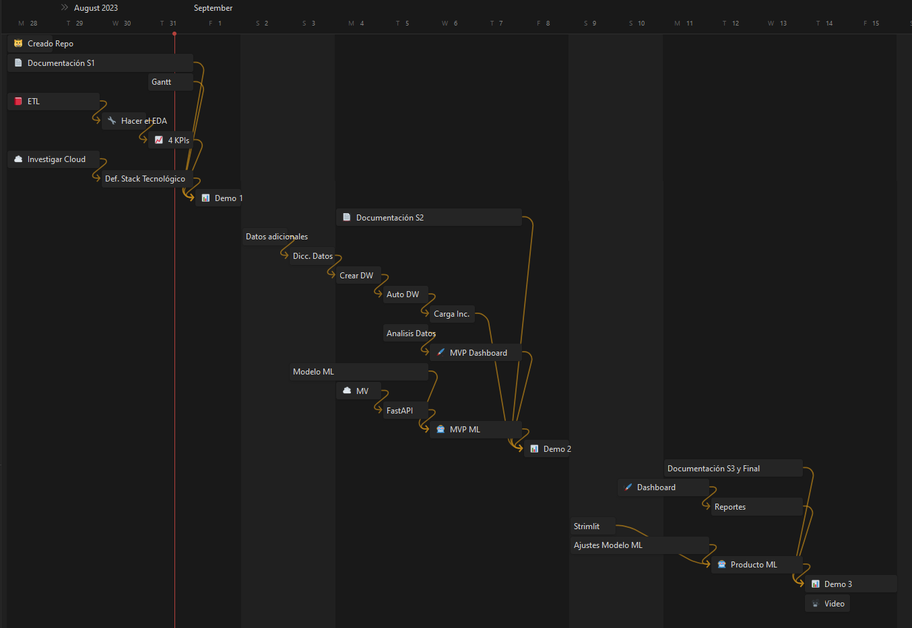

# <h1 align="center">**`Estudio de Flujos Migratorios en América.`**</h1>

# **`Sprint 1`**

## **Contexto**

En los últimos años han habido grandes flujos migratorios entre los distintos países de América. Éstos se han dado por diversas razones, como pueden ser la estabilidad, la educación y las oportunidades de empleo de un país.

### *Cliente*
La `Organización del Desarrollo y Bienestar` es una ONG que busca contribuir en la en la mejora de los ingresos de familias más vulnerables para que logren tener una mejor calidad de vida en el continente Americano.

## **Objetivo**

Analizar el flujo migratorio de las personas con el fin de proveer información a la ONG, para que conozca las razones principales de la migración y así poder realizar acciones que ataquen algunas de las problemáticas que las generan, mejorando así la calidad de vida de las personas.

## **Alcance**

Dado que la ONG actúa principalmente en América se van a trabajar con datos de países ese continente. Además se piensa estudiar desde el año 1990 porque es a partir de esas fechas que hay mayor cantidad de datos como para hacer un análisis más detallado. 

La calidad de vida se podría cuantificar con algunos indicadores como: años promedio de escolarización, desempleo, índice de desarrollo humano, pobreza, esperanza de vida al nacer.

### *Fuera de alcance*

Como hay mucha emigración desde América Latina hacia Europa se podría agregar en el estudio los países europeos como destino para poder compararlos con los países de América que podría brindar mas información sobre las causas de dicha migración.

## **Fuentes de datos**

Como fuente de datos principal se extrajeron datos del [Banco Mundial](https://datos.bancomundial.org/indicador), pero se complementó de otras fuentes como [UNDP](https://hdr.undp.org/data-center/documentation-and-downloads) (Programa de Desarrollo de las Naciones Unidas) y [Our World in Data](https://ourworldindata.org).

| Fuente | Tipo Datos | Última Actualización |
| - |- | - |
| Banco Mundial | [Migración neta](https://datos.bancomundial.org/indicator/SM.POP.NETM?end=2017&start=1962) | 2022 |
| Banco Mundial | [Desempleo](https://datos.bancomundial.org/indicador/SL.UEM.TOTL.ZS?view=chart) | 2022 |
| Banco Mundial | [PBi per capita](https://datos.bancomundial.org/indicador/NY.GDP.PCAP.CD?view=chart) | 2022 |
| UNDP | [HDI](https://hdr.undp.org/data-center/documentation-and-downloads) | 2021 |
| UNDP | [Esperanza_vida](https://hdr.undp.org/data-center/documentation-and-downloads) | 2021 |
| UNDP | [Año_prom_esc](https://hdr.undp.org/data-center/documentation-and-downloads) | 2021 |
| UNDP | [PBI_per_cap_aj](https://hdr.undp.org/data-center/documentation-and-downloads) | 2021 |
| Our World in data | [Pobreza](https://ourworldindata.org/poverty) | 2021 |

Dichos datos originales están en la carpeta [datos_crudos](datasets/datos_crudos).

## **ETL y EDA Preliminar**

Luego con los datos de las diversas fuentes, se hicieron varias limpiezas y estudio de la calidad del dato. Adicionalmente se juntaron en un único dataset con todas las variables relevantes para continuar el estudio y se exportaron a un archivo destino en [datos_procesados](datasets/datos_procesados).

### *Análisis*

Las variables a analizar en nuestro dataset son las siguientes:

| Fuente | Tipo Datos |
| - |- |
| Año | Año a los que corresponden los datos. |
| Migración neta | Diferencia entre la inmigración y la emigración. |
| Desempleo | Persona que busca empleo y pero no lo tiene. |
| PIB per cápita | Producto Interno Bruto por persona. |
| hdi | Indice de Desarrollo Humano. |
| Esperanza_vida | La esperanza de vida es la media de la cantidad de años que vive una determinada población. |
| Año_prom_esc | Número de años promedio de educación de una persona. |

Para evitar confuciones, recordemos que cuando la Migración Neta es
- **positiva**, significa que hay mas inmigración que emigración.
- **negativa**, significa que hay mas emigración que inmigración.

Del análisis se desprende por ejemplo que en varios paises hay una tendencia inversa entre el desempleo y el flujo migratorio.

Haciendo un poco mas amplio el análisis se puede observar la matriz de correlación (por ejemplo en este caso para Argentina) que el desempleo tiene una correlación inversa al flujo migratorio como se explicó anteriormente. Pero también se puede ver que otros indicadores como son el HDI, promedio años de escolarización y Esperanza de vida tienen una correlación positiva con respecto a la migración.

### *Conclusiones*

- En general el desempleo y la migración neta tienen una buena correlación. Esto sería razonable ya que cuando hay menos empleo es mas probable de que la gente salga a buscar nuevas oportunidades en otros países.

- Hay algunas excepciones como el caso de los Estados Unidos es un país que recibe tanta inmigración que por más que haya más desempleo su migración neta no se ve afectada.

- Tambien resulta interesante mencionar el caso de Venezuela, que a partir del año 2015, posiblemente consecuencia de la crisis economica a que apareció en la primera presidencia de Maduro, tuvo un gran crecimiento en la emigración de su país. Esto impactó en Varios países vecinos como el caso de Colombia que tuvieron un aumento enla inmigración a partir de ese periodo.

- Se podrian utilizar indicadores como el HDI, Desempleo y promedio años de escolarización como explicaciónes de ciertos flujos migratorios.

- Es importante remarcar que, siendo que tenemos datos de Migración Neta y no de inmigración y emigración, a veces resulta dificil detectar si fue que no hubo cambios en la migración o si en realidad hubo paro fue un cambio balanceado entre ambos valores que no se logra interpretar al analizar la migración neta.

Para un análisis más detallado de todo este proceso se puede consultar el [EDA](EDA.ipynb).

## **KPIs utilizados**

### **KPI 1: Desempleo**

Debido a que una de las propuestas que tiene la ONG es la de realizar campaña de empleo en los países mas vulnerables se puede utilizar un KPI que mida el porcentaje de desempleo y tenga como objetivo bajar 2 % en un año.

### **KPI 2: Escolaridad**

Otra forma con la que se quiere mejorar la calidad de vida es mejorando los niveles de escolaridad de la población para que a futuro logren tener más oportunidades de empleo. Teniendo esto en cuenta se puede medir la variación de los años de escolaridad y poner como objetivo el aumento de 1 año por año.

### KPI 3: Pobreza
Buscamos reducir la pobreza y mejorar la calidad de vida en comunidades vulnerables. Este KPI mide la proporción de población que vive bajo el umbral de pobreza. Nuestra meta es disminuir esta proporción en un 5% en un año a través de estrategias efectivas. Aspiramos a crear un entorno más equitativo y con mayores oportunidades para todos.

### KPI 4: HDI
A través de la esperanza de vida, educación e ingreso per cápita, el HDI refleja la salud, educación y bienestar de la población. Se relaciona con nuestro propósito de mejorar la calidad de vida en comunidades vulnerables. Al enlazar la atención médica, formación y reducción de desempleo y pobreza, este KPI busca aumentar el HDI en un 3% en un año.

## **Solución Propuesta**

Debajo se detalla la solución propuesta separando los distintos entregables en cada etapa del proyecto.

### *Sprint 1*

- Documentación de Contexto, Objetivo y Alcance del proyecto.
- Definición del Stack Tecnológico completo.
- Análisis Exploratorio de los Datos preliminar y definición de 4 KPI's a utilizar.

### *Sprint 2*

- Data Warehouse automatizado con Carga Inicial.
- Dashboard preliminar (MVP)
- Sistema preliminar de predicción de razones de flujos migratorios (MVP)

### *Sprint 3*

- Dashboard interactivo con KPI's que ayuden a analizar e interpretar las razones de los flujos migratorios.
- Una Web App para poder acceder al modelo predictivo para detectar de antemano cambios en flujos migratorios, detectando en qué países y que problemáticas así de esta forma se podrían tomar acciones preventivas.

## **Implementación de Stack Tecnológico**

Para poder implementar la solución propuesta se propone utilizar el Stack Tecnológico detallado debajo.

- Data Sources
    - Archivos `.csv` de distintas organizaciones como fuentes de datos relevantes.
- EDA en Python y Jupyter Notebook.
    - [Numpy](https://numpy.org/) y [Pandas](https://pandas.pydata.org/) para manejo de datos.
    - [Matplotlib](https://matplotlib.org/) y [Seaborn](https://seaborn.pydata.org/) para visualizaciones.
- Raw Data
    -  [GCP Cloud Storage](https://cloud.google.com/storage) para almacenar los datos crudos en la nube de GCP.
- Data Warehouse
    - [GCP BigQuery](https://cloud.google.com/bigquery) para transformar los datos crudos en un Data Warehouse.
- Data Visualization and Dashboard
    - [Power BI](https://powerbi.microsoft.com/es-es/) para generación de Dashboards y visualizaciones tomando datos directamente de nuestro Data Warehouse.
- Virtual Machine
    - [GCP Compute Engine](https://cloud.google.com/compute) para poder alojar nuestro modelo de Machine Learning y dejar una API para producir las predicciones del modelo.
        - Machine Learning Model
            - [scikit-learn](https://scikit-learn.org/stable/)
        - API
            - [Fast API](https://fastapi.tiangolo.com/)
- Web App
    - [Streamlit](https://streamlit.io/) para crear nuestra aplicación Web y que el cliente pueda interactuar de una forma amigable con nuestro sistema de predicción.

## **Metodologías de trabajo y organización**
Utilizamos un acercamiento a metodologías ágiles, definiendo las tareas que precisamos realizar en la semana para llegar al entregable pedido. Luego en las Daily meeting aprovechamos para hacer una puesta a punto de lo realizado, hablar sobre que problemas nos habíamos enfrentado y con que tareas ibamos a continuar.

### **Distribución de tareas y roles**
| Nombre            | Rol           |
|-------------------|---------------|
| Marcelo Suarez    | Data Analyst  |
| Nehuen Gonzalez   | Data Analyst  |
| Thiago Gonzales   | Data Engineer |
| Sebastián Besio   | Data Engineer |

### **Diagrama de Gantt**

Estimación de tareas para llegar en tiempo y forma a la finalización del proyecto el 15/09/23 contemplando los dos hitos intermedios.

