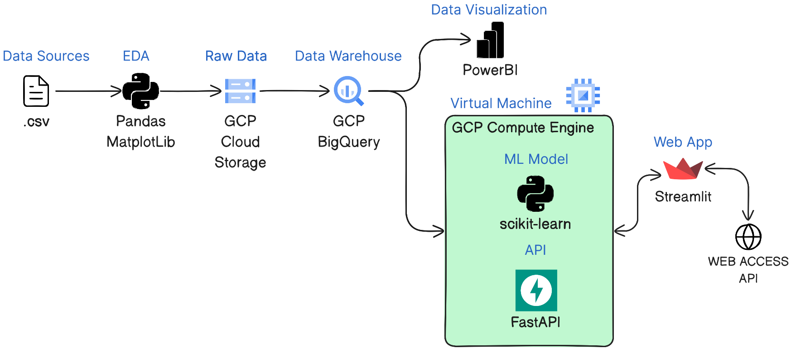

# <h1 align="center">**`Estudio de Flujos Migratorios en América.`**</h1>

# **`Sprint 1`**

## **Contexto**

En los últimos años han habido grandes flujos migratorios entre los distintos países de América que se han dado por diversas razones como pueden ser la estabilidad, la educación y las oportunidades de empleo de un país.

### *ONG*
La `Organización del Desarrollo y Bienestar` es una ONG que busca contribuir en la en la mejora de los ingresos de familias más vulnerables para que logren tener una mejor calidad de vida en el continente Americano.

Dicha ONG pretende conocer las razónes principales de la migración masiva de los países, y así poder realizar acciones que ataquen las problemáticas que las generan.

## **Objetivos**

- Analizar los flujos migratorios y poder conocer sus causas para conocer sus causas.
- Crear un Dashboard con KPI's que ayuden a analizar e interpretar 
- Generar un modelo predictivo para detectar de antemano cambios en flujos migratorios, detectando en que países y que problemáticas asi de esta forma se podrían tomar acciones preventivas.

## **Alcance**

Dado el enfoque de la ONG se van a trabajar con datos de paises de América. Además se piensa estudiar desde el año `1990?` porque a partir de esa fecha hay mayor cantidad de datos como para hacer un análisis mas detallado. Se va a trabajar con variables del estilo de calidad de vida, educación y establidad del país.

### *Fuera de alcance*

Como hay mucha emigración desde América Latina hacia Europa se podría agregar en el estudio los países europeos como destino para saber cuales son las causas de dicha migración.

## **Fuentes de datos**

Como fuente de datos principal se extrajeron datos del Banco Mundial, pero se complemento de otras fuentes como UNDP (Programa de Desarrollo de las Naciones Unidas) y `...`.

- [Banco Mundial](https://datos.bancomundial.org/indicador)
- [UNDP](https://hdr.undp.org/data-center/documentation-and-downloads)

## **KPIs utilizados**

*"Del entendimiento de la problemática surgirán cuestiones que se buscarán resolver con el trabajo o las herramientas desarrolladas. Estas cuestiones, formuladas como objetivos, admitirán la creación de KPIs para evaluar su cumplimiento. Es una tarea muy abarcativa y a la vez muy específica en torno tanto a la problemática como al enfoque elegido."*

### **KPI 1**
...

### **KPI 2**
...

### **KPI 3**
...

### **KPI 4**
...

## **EDA Preliminar**

*"Finalmente, como en Data es muy importante trabajar con datos de calidad, deberán incluir en su informe un análisis sobre los datos con los que van a trabajar (metadatos), detallandolos lo más posible: fuentes y confiabilidad de las mismas, qué representa cada columna de cada dataset, tipos de datos, método de adquisición, fecha de adquisición y ultima actualización, etc."*

## **Implementación de Stack Tecnológico**

*"Una parte muy importante de la solución propuesta, es con qué herramientas (stack tecnológico) van a realizar la arquitectura del proyecto. Para esto, lo que van a tener que hacer es seleccionar una pequeña porción de los datos que disponen y realizar un proceso de limpieza y transformación utilizando las herramientas que planean implementar. Esto les dará una idea de cómo funcionarán en el proyecto completo y les permitirá tener un mejor abordaje para futuras tareas. Hay que tener en cuenta que, como este ítem va a ser una presentación previa de lo que van a trabajar en el segundo sprint, el PO puede dar el OK o determinar cuál es el mejor camino para que tomen. Esto les va a permitir adelantar trabajo de la segunda semana, ya que no se va a tener que esperar hasta la segunda demo para verificar si la arquitectura cumple con los requisitos del PO."*

El Stack Tecnológico propuesto es el siguiente:

- Data Sources
    - Archivos `.csv` de distintas organizaciónes.
- EDA (Python)
    - [Numpy](https://numpy.org/) y [Pandas](https://pandas.pydata.org/) para manejo de datos.
    - [Matplotlib](https://matplotlib.org/) y [Seaborn](https://seaborn.pydata.org/) para visualizaciones.
- Raw Data
    -  [GCP Cloud Storage](https://cloud.google.com/storage)
- Data Warehouse
    - [GCP BigQuery](https://cloud.google.com/bigquery)
- Data Visualization and Dashboard
    - [Power BI](https://powerbi.microsoft.com/es-es/)
- Virtual Machine 
    - [GCP Compute Engine](https://cloud.google.com/compute)
        - Machine Learing Model
            - [scikit-learn](https://scikit-learn.org/stable/)
        - API
            - [Fast API](https://fastapi.tiangolo.com/)

## **Solución Propuesta**

*"Deben detallar qué tareas harán para cumplir los objetivos de trabajo propuestos previamente y cómo lo harán (metodologías de trabajo, forma de organización, distribución de tareas, roles de cada uno dentro del equipo, etc). También, deben detallar qué productos surgirán de su trabajo y en qué etapa los presentarán, teniendo en cuenta los requerimientos generales (entregables esperados) para cada etapa del proyecto."*   

### **Metodologías de trabajo**
...

### **Forma de organización**
...

### **Distribución de tareas y roles**
...

### **Cronograma de Gantt**
*"A su vez, deben realizar una estimación de tiempo para cada tarea, contemplando los tiempos de ejecución globales y los hitos previstos para cada semana; y plasmar esa estimación en un diagrama de Gantt."*

`PONER IMAGEN DE GANTT`

## Entregables Sprint 1

- Repositorio Github
- Documentación
- 4 KPIs
- EDA Preliminar, Calidad del dato
- Implementación Stak Propuesto
- Diagrama Gantt