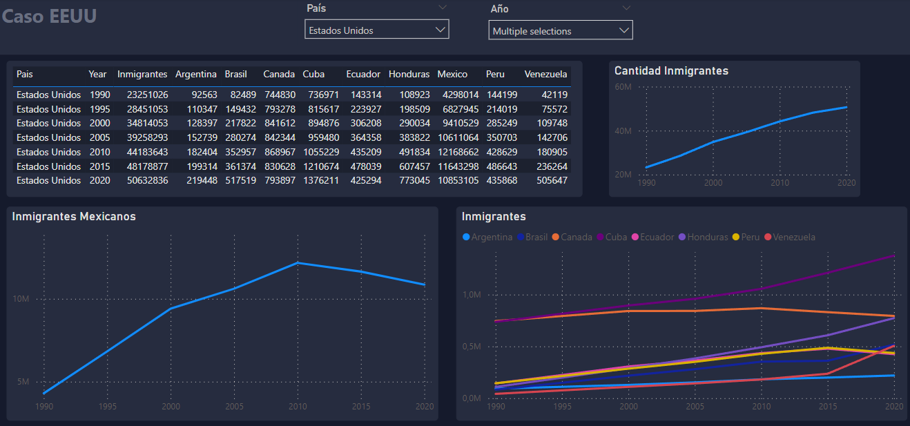
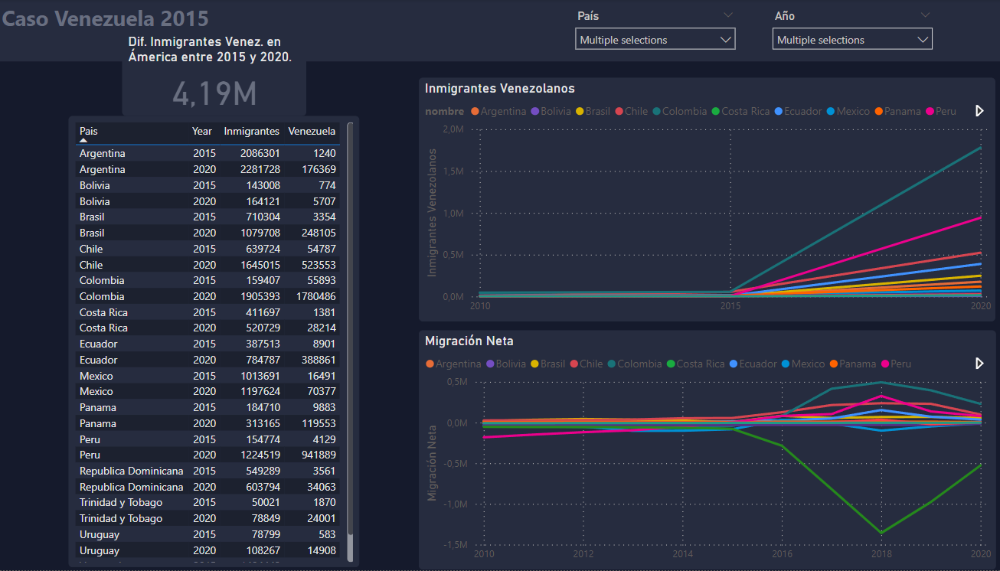
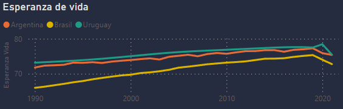
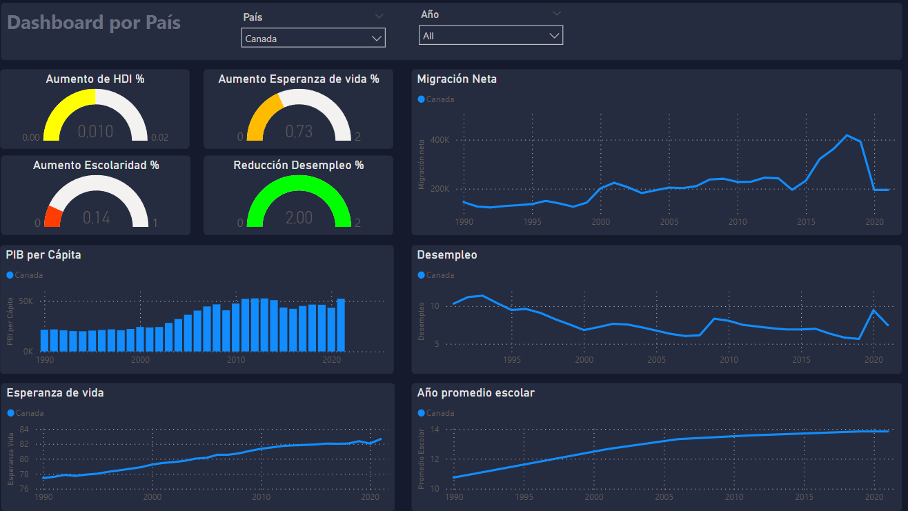

# <h1 align="center">**`SPRINT 2`**</h1>

### **Objetivo del Sprint**

- Documentación general de los trabajos.
- Workflow detallando tecnologías
- Diccionario de datos
- ETL completo
- Pipeline ETL automatizado
- Pipelines para alimentar el DW Automatizado e Incremental
- Data Warehouse
- Diagrama ER detallado (tablas, PK, FK y tipo de dato)
- Análisis de datos de muestra
- MVP de Dashboard

## **Implementación de Stack Tecnológico**

Se utilizó el siguiente Stack Tecnológico para implementar el workflow deseado.

- Data Sources
    - [API](https://documents.worldbank.org/en/publication/documents-reports/api) del Banco Mundial
    - [Web Scraping](https://datosmacro.expansion.com/demografia/migracion/inmigracion/argentina?anio=1990#geo0) pagina con datos de inmigración para varios países y años.
    - Descarga automática de [CSV](https://hdr.undp.org/sites/default/files/2021-22_HDR/HDR21-22_Composite_indices_complete_time_series.csv) de la [UNDP](https://hdr.undp.org/data-center/documentation-and-downloads) sobre indicadores varios de distintos paises entre 1990 y 2021.
- Raw ETL
    - Google [Cloud Function](https://cloud.google.com/functions) en Python para realizar ETL de la fuente de datos hacia el Bucket.
    - [Pandas](https://pandas.pydata.org/) para manejo de datos.
    - [urllib](https://docs.python.org/3/library/urllib.html), [regex](https://docs.python.org/3/library/re.html) y [Beautiful Soup](https://pypi.org/project/beautifulsoup4/) para Web Scraping.
    - [google.cloud.storage](https://cloud.google.com/python/docs/reference/storage/latest) para almacenar en Buckets de GCP.
- Raw Data
    -  [GCP Cloud Storage](https://cloud.google.com/storage) para almacenar los datos crudos en un Bucket en la nube de GCP.
- ETL hacia BigQuery
    - Google [Cloud Function](https://cloud.google.com/functions) en Python para realizar ETL desde el Bucket hacia BigQuery.
    - [Pandas](https://pandas.pydata.org/) para manejo de datos.
    - [google.cloud.storage](https://cloud.google.com/python/docs/reference/storage/latest) para almacenar en Buckets de GCP.
    - [google.cloud.bigquery](https://cloud.google.com/bigquery/docs/reference/libraries) para comunicarse, crear tablas y almacenar en BigQuery de GCP.
- Dataset
    - [GCP BigQuery](https://cloud.google.com/bigquery) para transformar los datos crudos en tablas.
- Data Visualization and Dashboard
    - [Power BI](https://powerbi.microsoft.com/es-es/) para generación de Dashboards y visualizaciones tomando datos directamente de nuestro Dataset.
- Automatización
    - [GCP Pub/Sub](https://cloud.google.com/pubsub) para manejo de triggers para activar Cloud Functions.
    - [GCP Cloud Scheduler](https://cloud.google.com/scheduler) para crear tareas programadas que ejecute los triggers de las Cloud Functions de forma periódica.

`Observación`: Por falta de tiempo se decidió posponer el modelo de predicción de machine learning para poder dedicar esfuerzos en poder brindar un producto de mayor calidad en el resto de las areas. Se estudiará durante el próximo sprint si podemos darle la dedicación que se merece o si queda para trabajo futuro (fuera de alcance).

## **ETL RAW**

Se extrajeron los datos de distintas fuentes, quitaron columnas, datos duplicados y NaNs. Además se unificaron nombres de paises en español, quitaron caracteres como tildes y 'ñ'. Por ultimo se dejaron en CSV en el Bucket. Todo implementado en Cloud Functions.

## **Diagrama de Entidad-Relacion y Diccionario de datos**

Tomando en cuenta los datos se diseñó un diagrama ER. Las tablas fueron creadas utilizando Python y [google.cloud.bigquery](https://cloud.google.com/bigquery/docs/reference/libraries).

* Como se puede ver la tabla de hechos se llama 'migración', tiene valores de Año y migracion Neta y foreign keys hacia el resto de las tablas.
* Luego tenemos una tabla dimensional de 'pais' con un id_pais y nombre para cada pais.
* Hay dos tablas más de factores económicos y sociales y una de inmigración que tiene la composición de los paises de origen de los inmigrantes de un pais dado.
* En todas las tablas excepto la de 'pais' se crearon primary keys con una codificación entre el Año y el id_pais ya que eran valores que relacionaban a todos los datos y esa combinación hacia que fueran únicos.

### *'migracion'* (Tabla de Hechos)

| Fuente | Tipo Datos | Descripcion |
| - |- |- |
| id_migracion | INT | Primary Key |
| anio | DATE | Año a los que corresponden los datos. |
| Migración neta | INT | Migración neta, diferencia entre la inmigración y la emigración. |
| id_pais | INT | Foreign key de la tabla 'pais' |
| id_fac_soc | INT | Foreign key de la tabla 'fac_social' |
| id_fac_eco | INT | Foreign key de la tabla 'fac_economico' |
| id_inmigracion | INT | Foreign key de la tabla 'inmigracion' |

### *'pais'*

| Fuente | Tipo Datos | Descripcion |
| - |- |- |
| id_pais | INT | Primary Key |
| nombre | INT | Nombre del pais. |

### *'fac_economico'* (factores economicos)

| Fuente | Tipo Datos | Descripcion |
| - |- |- |
| id_fac_eco | INT | Primary Key |
| Desempleo | FLOAT | Persona que busca empleo y pero no lo tiene. |
| PIB per cápita | FLOAT | Producto Interno Bruto por persona. |
| PIB per cápita ajustado | FLOAT | Producto Interno Bruto por persona ajustado por paridad de poder adquisitivo (PPA) en el año 1990. |

### *'fac_social'* (factores sociales)

| Fuente | Tipo Datos | Descripcion |
| - |- |- |
| id_fac_soc | INT | Primary Key |
| hdi | FLOAT | Indice de Desarrollo Humano. |
| Esperanza_vida | FLOAT | La esperanza de vida es la media de la cantidad de años que vive una determinada población. |
| Año_prom_esc | FLOAT | Número de años promedio de educación de una persona. |

### *'inmigracion'*

| Fuente | Tipo Datos | Descripcion |
| - |- |- |
| id_inmigracion | INT | Primary Key |
| hombres | INT | Cantidad de hombres que inmigraron al país. |
| mujeres | INT | Cantidad de mujeres que inmigraron al país. |
| total | INT | Cantidad de inmigrantes. |
| Antigua_y_Barbuda | INT | Cantidad de inmigrantes provenientes de Antigua y Barbuda. |
| Argentina | INT | Cantidad de inmigrantes provenientes de Argentina. |
| (*) | INT | ... |
| Uruguay | INT | Cantidad de inmigrantes provenientes de Uruguay. |
| Venezuela | INT | Cantidad de inmigrantes provenientes de Venezuela. |

(*) Lista con los 30 paises de estudio de Ámerica.

## **ETL hacia BigQuery**

Se leyeron los datos limpios crudos del Bucket y se prepararon DataFrames con la estructura que esperaba cada tabla definida en el modelo ER. Además se respaldaron en el Bucket en formato CSV.

## **Automatizacion y carga incremental**

Se crearon tareas programadas para correr cada 1 semana que corre las Cloud Function. Primero corre las que hace el RAW ETL y luego el ETL hacia BigQuery.

Cuando corre la Cloud Function de ETL hacia BigQuery levanta los datos completos del CSV y los compara con los datos que ya tiene la tabla utilizando Primary Keys y solo agrega un dato cuando es nuevo

## **Analisis de datos**

### **Inmigración EEUU**

La disminución en la emigración de México a los Estados Unidos a partir de 2010 puede atribuirse a una combinación de factores económicos, demográficos y políticos, las razones claves fueron:

* Cambios en la economía: Durante la década de 2000, México experimentó un crecimiento económico moderado y una mejora en las oportunidades laborales en ciertas industrias, como la manufactura y la tecnología. Esto redujo la necesidad de que las personas emigraran en busca de empleo en los Estados Unidos.
* Crisis económicas en los Estados Unidos: La crisis financiera global de 2008 y la recesión que siguió afectaron negativamente el empleo y las oportunidades económicas en los Estados Unidos. Esto hizo que el país fuera menos atractivo para los migrantes mexicanos en busca de trabajo.
* Mayor control fronterizo: El gobierno de los Estados Unidos implementó medidas más estrictas de control fronterizo y deportación en la década de 2010, lo que hizo más difícil para los mexicanos ingresar y permanecer en el país de manera irregular.
* Mayor inversión en educación: México invirtió en programas educativos y capacitación laboral para mejorar las habilidades de su fuerza laboral, lo que aumentó las perspectivas de empleo en el país y redujo la necesidad de emigrar.

### **Inmigración Argentina**

Poner algo `ARG??`

### **Caso Venezuela**

Continuado con el análisis del EDA, se puede observar la gran emigración de Venezuela desde el 2015, posiblemente consecuencia de la crisis economica a que apareció en la primera presidencia de Maduro, tuvo un gran crecimiento en la emigración de su país. Esto impactó en Varios países vecinos como el caso de Colombia que tuvieron un aumento enla inmigración a partir de ese periodo.

Entre 2015 y 2020 aumentaron a mas de 4 millones los inmigrantes Venezolanos en los distintos paises de Ámerica, siendo los destinos mas notables Colombia que tuvo un aumento de mas de 1,7 millones de Venezolanos en ese periodo. Seguidos por Perú con un aumento de más de 900 mil y Chile con más de 450 mil Venezolanos.

### **Reducción Esperanza Vida 2020**

Se puede observar algo curioso con la Esperanza de Vida. En general es un factor creciente pero si observamos la diferencia entre el 2019 y el 2020 hay una baja significativa. Esto se podria atribuir a la Pandemia Covid-19.

En la gráfica se muestra como la mayoria de los países tuvo una disminución de la esperanza de vida en el 2020. También se puede ver un outlier en la esperanza de vida de Uruguay que tuvo un aumento en el 2020 y recién tuvo una disminución en 2021, esto se atribuye porque en el 2020 no fue afectado en gran medida por la pandemia y si fue afectado en la ola de contagios del 2021.

## **DASHBOARD**

A la izquierda se encuentran 4 KPIs luego se puede ver varias gráficas para ver las tendencias de las distintas variables a lo largo de los años, pudindo filtrar por años y paises.

### **KPI 1: Reducción del Desempleo**

Debido a que una de las propuestas que tiene la ONG es la de realizar campaña de empleo en los países mas vulnerables se puede utilizar un KPI que mida el porcentaje de desempleo y tenga como objetivo bajar 2 % en dos años.

### **KPI 2: Mejora Escolaridad**

Otra forma con la que se quiere mejorar la calidad de vida es mejorando los niveles de escolaridad de la población para que a futuro logren tener más oportunidades de empleo. Teniendo esto en cuenta se puede medir la variación de los años de escolaridad y poner como objetivo el aumento de 1 año en 5 años.

### **KPI 3: Esperanza de vida**
Adicionalmente se puede mirar mejorar la esperanza de vida de la población teniendo como objetivo el aumento de 2 % en 5 años.

### **KPI 4: HDI**
El HDI refleja la salud, educación y bienestar de la población. Se relaciona con nuestro propósito de mejorar la calidad de vida en comunidades vulnerables. Al enlazar la atención médica, formación, reducción de desempleo y pobreza, este KPI busca aumentar el HDI en un 2% en 5 años.

