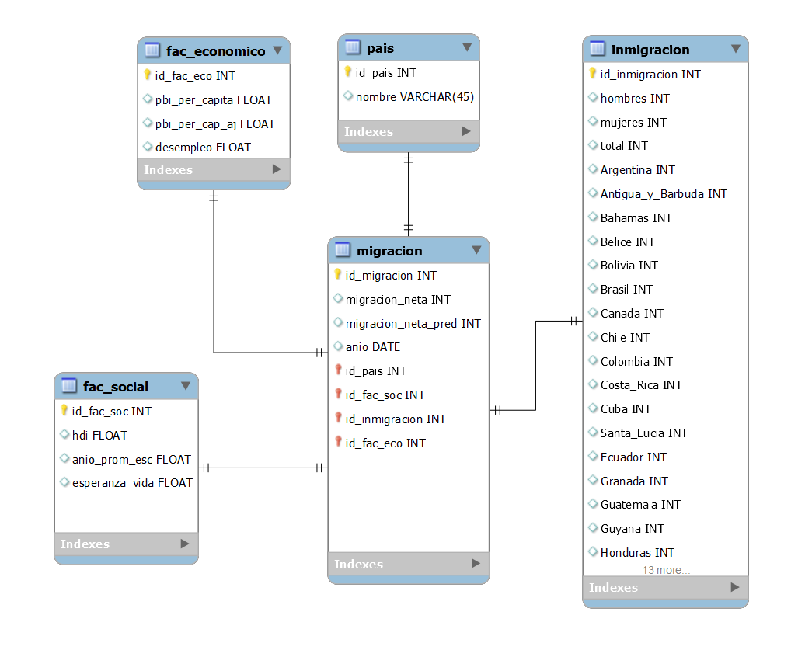

# <h1 align="center">**`SPRINT 2`**</h1>

### **Objetivo del Sprint**

- Documentación general de los trabajos.
- Workflow detallando tecnologías
- Diccionario de datos
- ETL completo
- Pipeline ETL automatizado
- Pipelines para alimentar el DW Automatizado e Incremental
- Data Warehouse
- Diagrama ER detallado (tablas, PK, FK y tipo de dato)
- Análisis de datos de muestra
- MVP de Dashboard

## **Implementación de Stack Tecnológico**

Se utilizó el siguiente Stack Tecnológico para implementar el workflow deseado.

- Data Sources
    - [API](https://documents.worldbank.org/en/publication/documents-reports/api) del Banco Mundial
    - [Web Scraping](https://datosmacro.expansion.com/demografia/migracion/inmigracion/argentina?anio=1990#geo0) pagina con datos de inmigración para varios países y años.
    - Descarga automática de [CSV](https://hdr.undp.org/sites/default/files/2021-22_HDR/HDR21-22_Composite_indices_complete_time_series.csv) de la [UNDP](https://hdr.undp.org/data-center/documentation-and-downloads) sobre indicadores varios de distintos paises entre 1990 y 2021.
- Raw ETL
    - Google [Cloud Function](https://cloud.google.com/functions) en Python para realizar ETL de la fuente de datos hacia el Bucket.
    - [Pandas](https://pandas.pydata.org/) para manejo de datos.
    - [urllib](https://docs.python.org/3/library/urllib.html), [regex](https://docs.python.org/3/library/re.html) y [Beautiful Soup](https://pypi.org/project/beautifulsoup4/) para Web Scraping.
    - [google.cloud.storage](https://cloud.google.com/python/docs/reference/storage/latest) para almacenar en Buckets de GCP.
- Raw Data
    -  [GCP Cloud Storage](https://cloud.google.com/storage) para almacenar los datos crudos en un Bucket en la nube de GCP.
- ETL hacia BigQuery
    - Google [Cloud Function](https://cloud.google.com/functions) en Python para realizar ETL desde el Bucket hacia BigQuery.
    - [Pandas](https://pandas.pydata.org/) para manejo de datos.
    - [google.cloud.storage](https://cloud.google.com/python/docs/reference/storage/latest) para almacenar en Buckets de GCP.
    - [google.cloud.bigquery](https://cloud.google.com/bigquery/docs/reference/libraries) para comunicarse, crear tablas y almacenar en BigQuery de GCP.
- Dataset
    - [GCP BigQuery](https://cloud.google.com/bigquery) para transformar los datos crudos en tablas.
- Data Visualization and Dashboard
    - [Power BI](https://powerbi.microsoft.com/es-es/) para generación de Dashboards y visualizaciones tomando datos directamente de nuestro Dataset.
- Automatización
    - [GCP Pub/Sub](https://cloud.google.com/pubsub) para manejo de triggers para activar Cloud Functions.
    - [GCP Cloud Scheduler](https://cloud.google.com/scheduler) para crear tareas programadas que ejecute los triggers de las Cloud Functions de forma periódica.

`Observación`: Por falta de tiempo se decidió posponer el modelo de predicción de machine learning para poder dedicar esfuerzos en poder brindar un producto de mayor calidad en el resto de las areas. Se estudiará durante el próximo sprint si podemos darle la dedicación que se merece o si queda para trabajo futuro (fuera de alcance).

## **RAW ETL**

Se extrajeron los datos de distintas fuentes, quitaron columnas, datos duplicados y NaNs. Además se unificaron nombres de paises, quitaron caracteres como tildes y 'ñ'. Por ultimo se dejaron en CSV en el Bucket.

## **Diagrama de Entidad-Relacion y Diccionario de datos**

Tomando en cuenta los datos se diseñó un diagrama ER. Las tablas fueron creadas utilizando Python y [google.cloud.bigquery](https://cloud.google.com/bigquery/docs/reference/libraries).

### *'migracion'* (Tabla de Hechos)

| Fuente | Tipo Datos | Descripcion |
| - |- |- |
| id_migracion | INT | Primary Key |
| anio | DATE | Año a los que corresponden los datos. |
| Migración neta | INT | Migración neta, diferencia entre la inmigración y la emigración. |
| id_pais | INT | Foreign key de la tabla 'pais' |
| id_fac_soc | INT | Foreign key de la tabla 'fac_social' |
| id_fac_eco | INT | Foreign key de la tabla 'fac_economico' |
| id_inmigracion | INT | Foreign key de la tabla 'inmigracion' |

### *'pais'*

| Fuente | Tipo Datos | Descripcion |
| - |- |- |
| id_pais | INT | Primary Key |
| nombre | INT | Nombre del pais. |

### *'fac_economico'* (factores economicos)

| Fuente | Tipo Datos | Descripcion |
| - |- |- |
| id_fac_eco | INT | Primary Key |
| Desempleo | FLOAT | Persona que busca empleo y pero no lo tiene. |
| PIB per cápita | FLOAT | Producto Interno Bruto por persona. |
| PIB per cápita ajustado | FLOAT | Producto Interno Bruto por persona ajustado por paridad de poder adquisitivo (PPA) en el año 1990. |

### *'fac_social'* (factores sociales)

| Fuente | Tipo Datos | Descripcion |
| - |- |- |
| id_fac_soc | INT | Primary Key |
| hdi | FLOAT | Indice de Desarrollo Humano. |
| Esperanza_vida | FLOAT | La esperanza de vida es la media de la cantidad de años que vive una determinada población. |
| Año_prom_esc | FLOAT | Número de años promedio de educación de una persona. |

### *'inmigracion'*

| Fuente | Tipo Datos | Descripcion |
| - |- |- |
| id_inmigracion | INT | Primary Key |
| hombres | INT | Cantidad de hombres que inmigraron al país. |
| mujeres | INT | Cantidad de mujeres que inmigraron al país. |
| total | INT | Cantidad de inmigrantes. |
| Antigua_y_Barbuda | INT | Cantidad de inmigrantes provenientes de Antigua y Barbuda. |
| Argentina | INT | Cantidad de inmigrantes provenientes de Argentina. |
| (*) | INT | ... |
| Uruguay | INT | Cantidad de inmigrantes provenientes de Uruguay. |
| Venezuela | INT | Cantidad de inmigrantes provenientes de Venezuela. |

(*) Lista con los 30 paises de estudio de Ámerica.

## **ETL hacia BigQuery**

Se leyeron los datos limpios crudos del Bucket y se prepararon DataFrames con la estructura que esperaba cada tabla definida en el modelo ER. Además se respaldaron en el Bucket en formato CSV.

## **Automatizacion y carga incremental**

Se crearon tareas programadas para correr cada 1 semana que corre las Cloud Function. Primero corre las que hace el RAW ETL y luego el ETL hacia BigQuery.

Cuando corre la Cloud Function de ETL hacia BigQuery levanta los datos completos del CSV y los compara con los datos que ya tiene la tabla utilizando Primary Keys y solo agrega un dato cuando es nuevo

## **Analisis de datos**

``Venezuela 2015?``

``Pico Perú?``

``Argentina en los 90?``

## **DASHBOARD**

``Imagen de Dashboard?``

``Breve descripcion gral?``

### **KPI 1: Reducción del Desempleo**

Debido a que una de las propuestas que tiene la ONG es la de realizar campaña de empleo en los países mas vulnerables se puede utilizar un KPI que mida el porcentaje de desempleo y tenga como objetivo bajar 2 % en dos años.

### **KPI 2: Mejora Escolaridad**

Otra forma con la que se quiere mejorar la calidad de vida es mejorando los niveles de escolaridad de la población para que a futuro logren tener más oportunidades de empleo. Teniendo esto en cuenta se puede medir la variación de los años de escolaridad y poner como objetivo el aumento de 1 año por año.

### **KPI 3: Pobreza**
Buscamos reducir la pobreza y mejorar la calidad de vida en comunidades vulnerables. Este KPI mide la proporción de población que vive bajo el umbral de pobreza. Nuestra meta es disminuir esta proporción en un 5% en un año a través de estrategias efectivas. Aspiramos a crear un entorno más equitativo y con mayores oportunidades para todos.

### **KPI 4: HDI**
El HDI refleja la salud, educación y bienestar de la población. Se relaciona con nuestro propósito de mejorar la calidad de vida en comunidades vulnerables. Al enlazar la atención médica, formación, reducción de desempleo y pobreza, este KPI busca aumentar el HDI en un 3% en un año.

