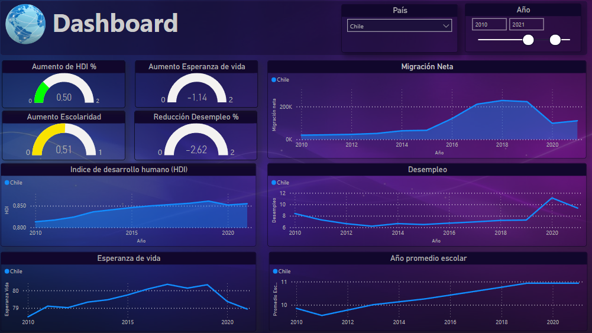
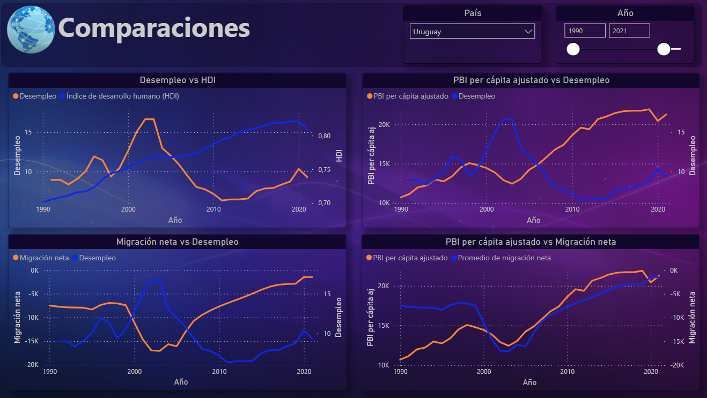
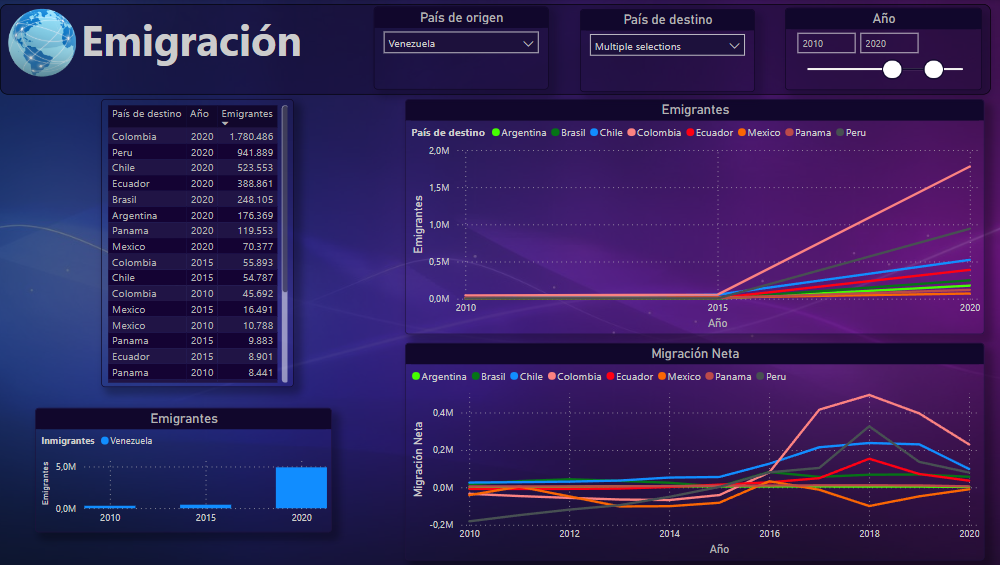
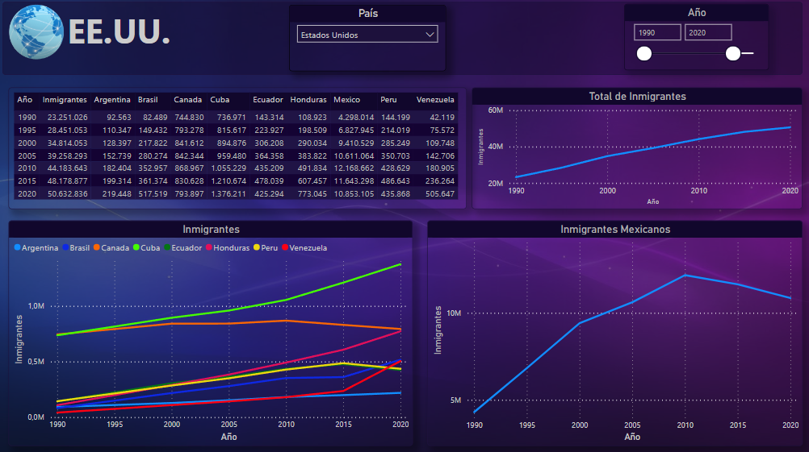
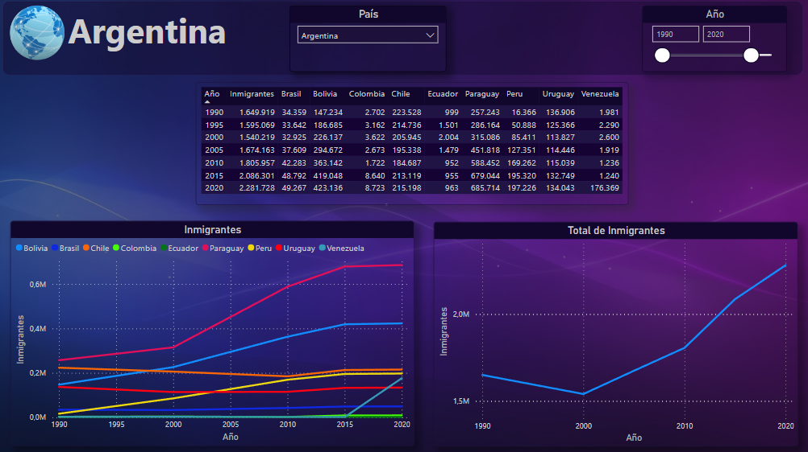
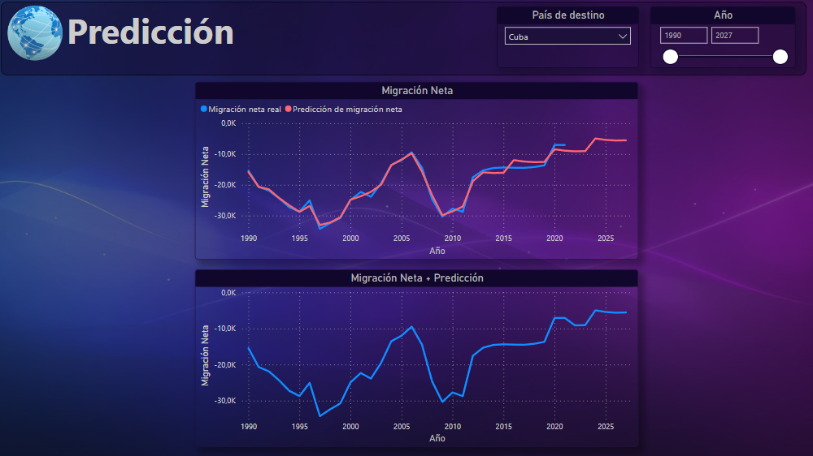

# <h1 align="center">**`SPRINT 3`**</h1>

### **Objetivo del Sprint**

- Storytelling
- Producto Dashboard y Reportes
- Modelado Predicción Machine Learning

# **Producto entregable**

El producto final es un dashboard y reportes interactivos implementado en Power BI.

Debajo les detallaremos las características principales del producto y algunos ejemplos de análisis realizados para que vean cómo podrían utilizarlo para sus propios análisis.

## **DASHBOARD**

A la izquierda se encuentran 4 KPIs luego se puede ver varias gráficas para ver las tendencias de las distintas variables a lo largo de los años, pudindo filtrar por años y paises.

### **KPIs**

- KPI 1: Reducción del Desempleo
- KPI 2: Mejora Escolaridad
- KPI 3: Esperanza de vida
- KPI 4: HDI

Detallados en [Sprint 2](README_Sprint2.md)

## **Comparaciones**

Donde se pueden ver comparaciones para ver relaciones entre varios indicadores. Como por ejemplo el desempleo y la migración neta.

## **Emigración**

En este reporte se pueden elegir el pais de origen de la emigración y los paises para estudiar los destinos de flujo migratorio. Se observa una gráfica que muestra el aumento de los emigrantes de ese pais hacia los destinos elegidos.

Además debajo a la izqueirda se puede ver la cantidad total de emigrantes que tiene el país de origen como para poder ver la diferencia en la imigración.

**Análisis**

``Venezuela 2015?``
``Cuba?``
``Otro?``

## **Inmigración**

``ALGO?``

**EE.UU.**

``ALGO?``

**Argentina**

``ALGO?``

## **Sistema Predicción**

**Forecasting**

El Forecasting consiste en la estimación y el análisis del valor de una variable futura mediante algoritmos.

**Prophet**

Es una herramienta de codigo abierto diseñada por Meta en 2017 para predecir valores futuros basados en datos historicos (Forecasting).

[Introducción Prophet](https://facebook.github.io/prophet/)

[Documentación Prophet](https://facebook.github.io/prophet/docs/quick_start.html)

`COMO FUNCIONA?`

**Predicción de Migración Neta**

El modelo de predicción se agregó a una Cloud Function, en donde toma la migración neta y pronostica su valor para los proximos 5 años futuros. No se hace para mas años ya que mientras mas lejana la predicción mas imprecisa es.

Esos datos se agregaron en el campo migracion_neta_pred dentro de la tabla de migracion de BigQuery para luego poder consultarlos directamente desde Power BI.

