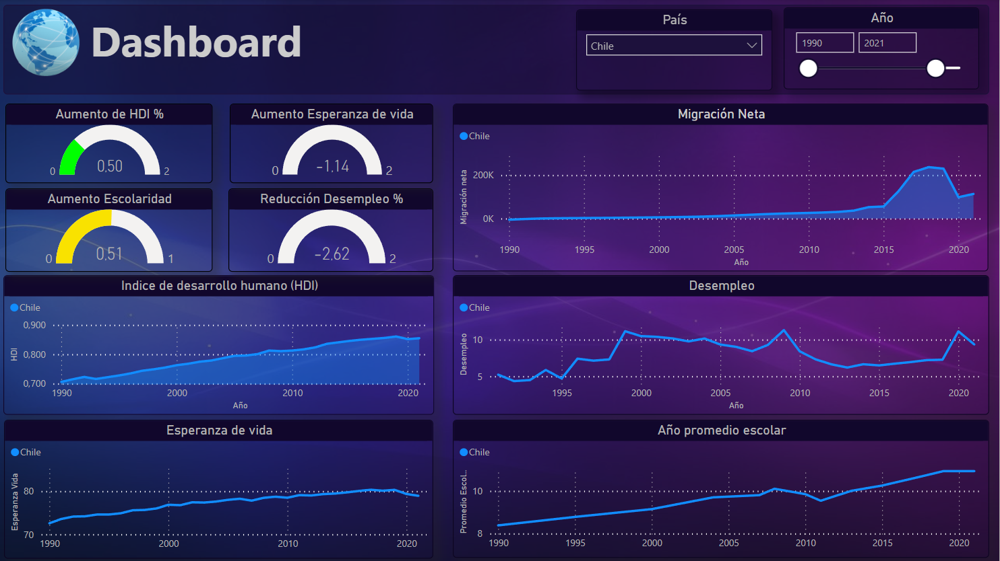

# <h1 align="center">**`SPRINT 3`**</h1>

### **Objetivo del Sprint**

- Storytelling
- Producto Dashboard y Reportes
- Modelado Predicción Machine Learning

# **Producto entregable**

El producto final es un dashboard y reportes interactivos implementado en Power BI.

Debajo les detallaremos las caracteristicas principales del producto y algunos ejemplos de análisis realizados para que vean cómo podrían utilizarlo para sus propios análisis.

## **DASHBOARD**

``Breve descripcion gral?``

``KPIs de nuevo?``

## **Comparaciones**

Donde se pueden ver comparaciones para ver relaciones entre varios indicadores. Como por ejemplo el desempleo y la migración neta.

``Desempleo vs mig neta?``

## **Emigración**

En este reporte se pueden elegir el pais de origen de la emigración y los paises destino para estudiar los destinos de flujo migratorio. Se observa una grafica que muestra el aumento de los emigrantes de ese pais hacia los destinos elegidos.

Ademas debajo a la izqueirda se puede ver la cantidad total de emigrantes que tiene el país de origen como para poder ver la diferencia en la imigración.

**Análisis ejemplo**

``Venezuela 2015?``
``Cuba?``
``Otro?``

## **Inmigración**

``ALGO?``

**EE.UU.**

``ALGO?``

**Argentina**

``ALGO?``

``Comentar que le falta mejora para hacerlo interactivo????``

## **Sistema Prediccion**

**Forecasting**

El Forecasting consiste en la estimación y el análisis de la demanda futura mediante algoritmos. La demanda futura de un producto en una empresa viene condicionada por múltiples factores, en ocasiones difíciles de determinar con exactitud.

``Imagen de ejemplo forecasting o prophet``

Algo asi en español?

Prophet is a procedure for forecasting time series data based on an additive model where non-linear trends are fit with yearly, weekly, and daily seasonality, plus holiday effects. It works best with time series that have strong seasonal effects and several seasons of historical data. Prophet is robust to missing data and shifts in the trend, and typically handles outliers well...

[Introducción Prophet](https://facebook.github.io/prophet/)

[Documentación Prophet](https://facebook.github.io/prophet/docs/quick_start.html)

Prediccion
- Hablar mínimamente de prophet y forecasting (pronósticos)
    - ¿Qué es Forecasting (pronósticos)?
    - ¿Porque usamos? Para predecir migración neta a futuro.
    - ¿Cómo funciona el modelo?
    - Librería usada Prophet, es de Meta (FB) disponibilizado en 2017
- La colocamos en una Cloud Function los resultados de las predicciones se agregaron como nuevo campo de la tabla migraciones con el nombre de migración neta pred.
- Se hicieron predicciones de hasta 5 años (porque mientras más lejanas más imprecisas son).

