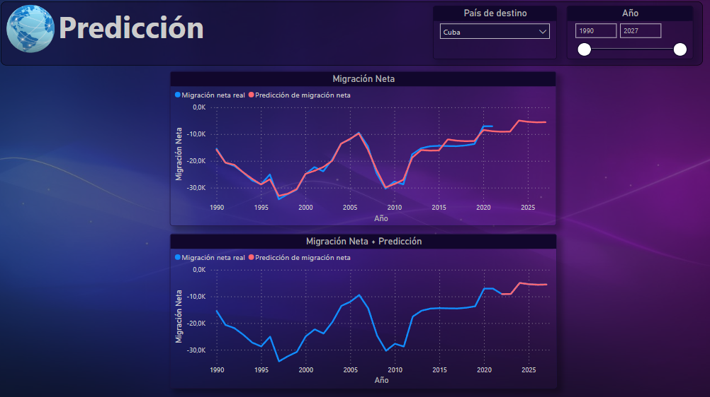

# <h1 align="center">**`SPRINT 3`**</h1>

### **Objetivo del Sprint**

- Storytelling
- Producto Dashboard y Reportes
- Modelado Predicción Machine Learning

# **Producto entregable**

El producto final es un dashboard y reportes interactivos implementado en Power BI.

Debajo les detallaremos las caracteristicas principales del producto y algunos ejemplos de análisis realizados para que vean cómo podrían utilizarlo para sus propios análisis.

## **DASHBOARD**

``Breve descripcion gral?``

``KPIs de nuevo?``

## **Comparaciones**

`IMAGEN`

``Desempleo vs mig neta?``

## **Emigración**

`IMAGEN`

**Análisis ejemplo**

``Venezuela 2015?``
``Cuba?``
``Otro?``

## **Inmigración**

`IMAGEN`

**Análisis ejemplo**

``EEUU?``
``ARG?``

``Comentar que le falta mejora para hacerlo interactivo?``

## **Sistema Prediccion**

``Imagen de ejemplo forecasting o prophet``

Prediccion
- Hablar mínimamente de prophet y forecasting (pronósticos)
    - ¿Qué es Forecasting (pronósticos)?
    - ¿Porque usamos? Para predecir migración neta a futuro.
    - ¿Cómo funciona el modelo?
    - Librería usada Prophet, es de Meta (FB) disponibilizado en 2017
- La colocamos en una Cloud Function los resultados de las predicciones se agregaron como nuevo campo de la tabla migraciones con el nombre de migración neta pred.
- Se hicieron predicciones de hasta 5 años (porque mientras más lejanas más imprecisas son).

